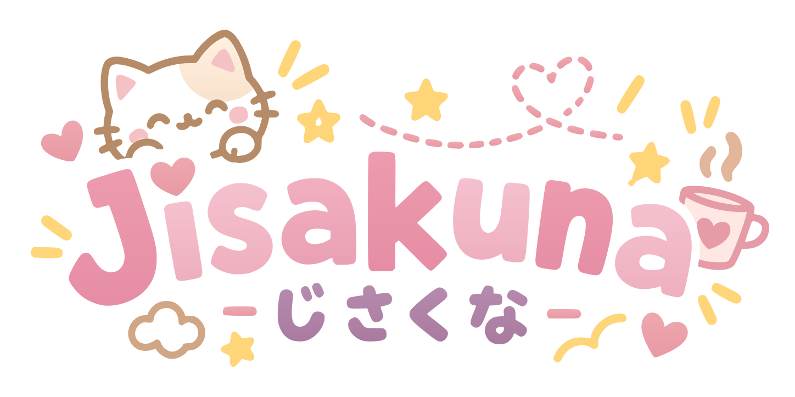

Exploring robotics, multimodal data, and tools that make development more enjoyable. 
Learning through projects, one experiment at a time.

*A few tools from my projects.*

[Projects](https://github.com/Jisakuna?tab=repositories) · [X](https://x.com/Ji_sakuna) · [LinkedIn](https://www.linkedin.com/in/ji-sakuna-4673a539a/)

---

## Sponsors

If you enjoy what I build, thank you for being here. Exploring a project, sharing feedback, or contributing code all mean a lot.

**Thank you to my sponsors for supporting my work!**

<!--
Maintainer setup:
Add an Actions secret named SPONSORKIT_GITHUB_TOKEN with read:user and read:org scopes.
Run the Update sponsors workflow to generate and commit the sponsor files.
For local updates, set SPONSORKIT_GITHUB_TOKEN, run pnpm install, then pnpm exec sponsorkit.
Commit pnpm-lock.yaml and sponsorkit/, including .cache.json.
-->
